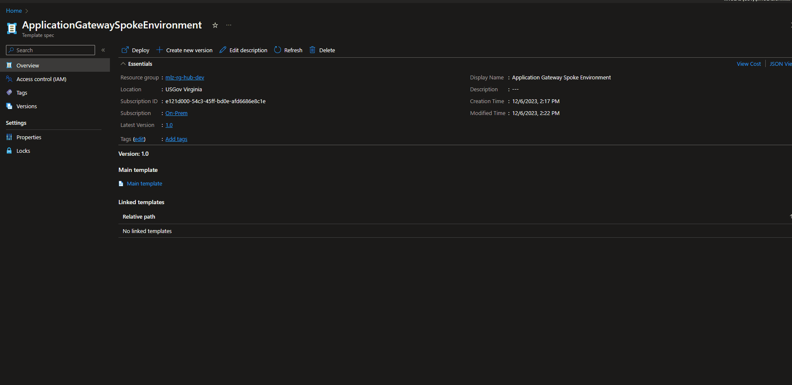

# Mission Owner Environment - Application Gateway Spoke Environment #

## Application Gateway Example ##

This example deploys a Tier 3 environment to support an Application Service Environment, App Service, and Application Gateway Integration.

Read on to understand what this example does, and when you're ready, collect all of the pre-requisites, then deploy the example.

## Pre-requisites ##

- An exisiting Mission Landing Zone (MLZ) hub and spoke deployment
- A certificate to be used with the web app as a PFX uploaded to the storage account in the MLZ hub

## Upload the following scripts and files to your storage account container ###

*[Az.Accounts 2.13.0 PowerShell Module](https://www.powershellgallery.com/api/v2/package/Az.Accounts/2.13.0)
*[Az.Automation 1.9.0 PowerShell Module](https://www.powershellgallery.com/api/v2/package/Az.Automation/1.9.0)
*[Az.Keyvault 4.11.0 PowerShell Module](https://www.powershellgallery.com/api/v2/package/Az.Resources/4.11.0)
*[Az.Network 6.2.0 PowerShell Module](https://www.powershellgallery.com/api/v2/package/Az.Resources/6.2.0)
*[Az.Resources 6.6.0 PowerShell Module](https://www.powershellgallery.com/api/v2/package/Az.Resources/6.6.0)

## Creating Template Spec ##

Use the PowerSHell example below to create a template spec.

### Example ###

*[Create and deploy template spec](https://learn.microsoft.com/en-us/azure/azure-resource-manager/templates/quickstart-create-template-specs?tabs=azure-powershell)

```powershell
[CmdletBinding(SupportsShouldProcess)]
param (
[Parameter(Mandatory)]
[string]$TemplateSpecName,
[Parameter(Mandatory)]
[string]$Location,
[Parameter(Mandatory)]
[string]$ResourceGroupName
)

New-AzTemplateSpec `
  -Name $TemplateSpecName `
  -ResourceGroupName $ResourceGroupName `
  -Version '1.0' `
  -Location $Location `
  -DisplayName "Application Gateway Spoke Environment" `
  -TemplateFile '.\main.json' `
  -UIFormDefinitionFile '.\uiDefinition.json' `
  -Force
```

## Example depoyment using Custom TemplateSpec User Interface ##



## References ##

*[Upload, download, and list blobs with the Azure portal](https://learn.microsoft.com/en-us/azure/storage/blobs/storage-quickstart-blobs-portal)
*[Create certificates to allow the backend with Azure Application Gateway](https://learn.microsoft.com/en-us/azure/application-gateway/certificates-for-backend-authentication)
*[Generate an Azure Application Gateway self-signed certificate with a custom root CA](https://learn.microsoft.com/en-us/azure/application-gateway/self-signed-certificates)
